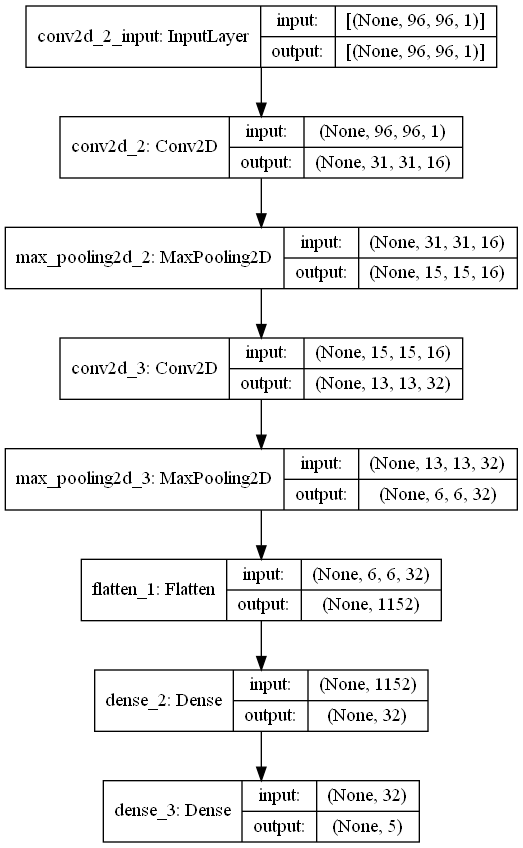
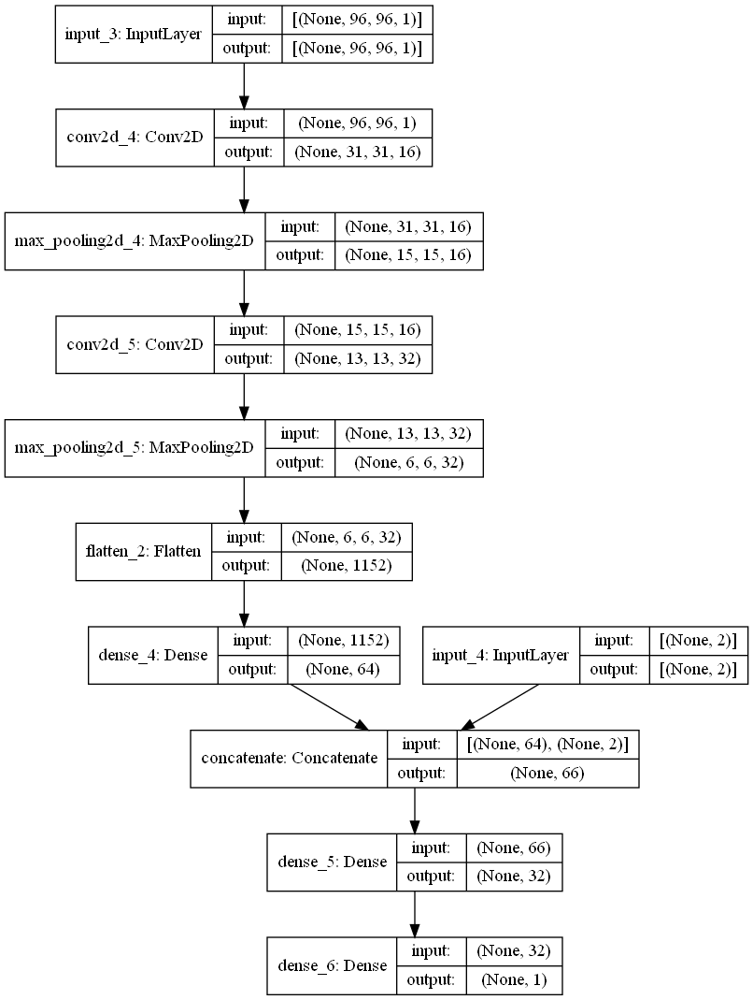

# Car Racing DDPG agent

## By: Chiriac Cătălin, Vătui Adrian

### Development

We started out by trying a simple Q-learning solution that only used one network to approximate the Q-value and decide
between 5 discrete actions (do nothing, left, right, accelerate, break). The agent however did not perform that well,
only obtaining a score of around

We then moved on to another approach - Deep Deterministic Policy Gradient. This solution uses 4 networks (actor, critic
and one target network for each) in order to learn on-policy and output actions in a continuous search space. We learned
a lot about the algorithm and took inspiration from [here](https://spinningup.openai.com/en/latest/algorithms/ddpg.html)
and [here](https://keras.io/examples/rl/ddpg_pendulum/).

### Results

The best configuration we obtained has an average score of 800 points. It tends to drive on the side of the road (to
have more space to turn in curves) and to drive at high speeds to get more points quickly. Sometimes it gets a lower
score because the car starts going backwards on the track after spinning out, since it doesn't know what the right way
forward is. It tends to finish the course before the time limit (after which the score doesn't increase anymore). You
can clearly see it has learned to break before sharp turns.

The networks in the bestSolution folder, after training for 600 episodes and with an average score around 800-850:

After more training, we can see that the agent learns to favour speed over control and starts cutting corners and
driving alarmingly fast, often finishing more than 1 and a third complete circuits. This leads to lower scores, partly
because of the "missed" tiles in curves, partly because of the increased frequency of spin-outs and drifting. This
particular model was even trained with a further reduction of speed of 1.5 instead of 1.25, but it just lowered the
acceleration, not the maximum speed.

The networks in the bestConfig2 folder, after training for 2100 episodes and with an average score of 740:

### Network architecture

#### Basic agent

For the basic agent, we used 2 convolutional layers with max pooling between them, followed by a 64-perceptron dense
layer and an output layer of 5 neurons, each of them representing the one of the 5 discrete actions. To decide on an
action, we simply picked the one with the largest value.

#### DDPG actor

The architecture is very similar to the one we used before, the only exception being that we added a Gaussian Noise
layer, and the output layer has only 2 neurons since we only need 2 values (steering and acceleration/brake).

#### DDPG critic

The critic also uses the same structure as the other networks, but its first dense layer also takes the output of the
actor as input. Its output layer has only one neuron, since it just needs to approximate `Q(state, action)`.

### Implementation details

Some interesting "hacks" we used:

* The actor uses tanh as the activation function for its final layer, since it outputs values in the [-1, 1] range,
  which is exactly what is needed for the action space
* Even though an action needs 3 values, the actor only outputs 2, since braking and accelerating at the same time is
  never needed
* The actor is polled every 2 frames
* Actions are divided by 4 to make the control easier and the speed divided by a further 1.25 to try and make it drive
  more slowly.
* The actor's output has some Gaussian noise added. After obtaining a score of over 800 (very good), we remove the noise
  in order to force the network to exploit its current configuration, but if the score drops, the noise is added back to
  encourage exploration.